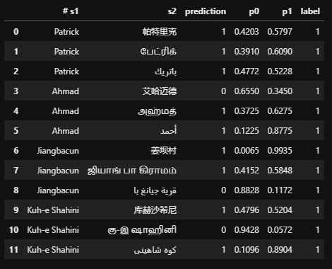

# Multilingual Name Matching
In computer science, approximate string matching (often referred to as fuzzy string searching) is the technique of finding strings that match a pattern approximately. The problem of approximate string matching is typically divided into two sub-problems: finding approximate substring matches inside a given string and finding dictionary strings that match the pattern approximately. In this project we trained, finetuned, and test a fuzzy matching model for four common languages in Malaysia such as Malay, Arabic, Mandarin, and Tamil. In this project, we utilised an open source library called DeezyMatch which has the capability of doing as this repository is named.

## How to use this repository?
- <b>a) Install DeezyMatch library</b>
  - pip install DeezyMatch (this library only works on Linux)
  
- <b>b) Edit the train, finetune, and test text files based on your preferences</b>
  - You can find the original training set in this link https://github.com/ruipds/Toponym-Matching/tree/master/dataset which is about 300 MB and set it as your training set
  - Finetune set can be set based on your training set preferences
  - Test set is the dataset that you want the model to predict for their labels
  
- <b>c) Run the scripts in sequence</b>
  - Before running the scripts, ensure that all paths and model name is correctly written
  - Run train.py
  - Run plot.py
  - Run finetune.py
  - Run test.py

- <b>d) Example of prediction output</b>

